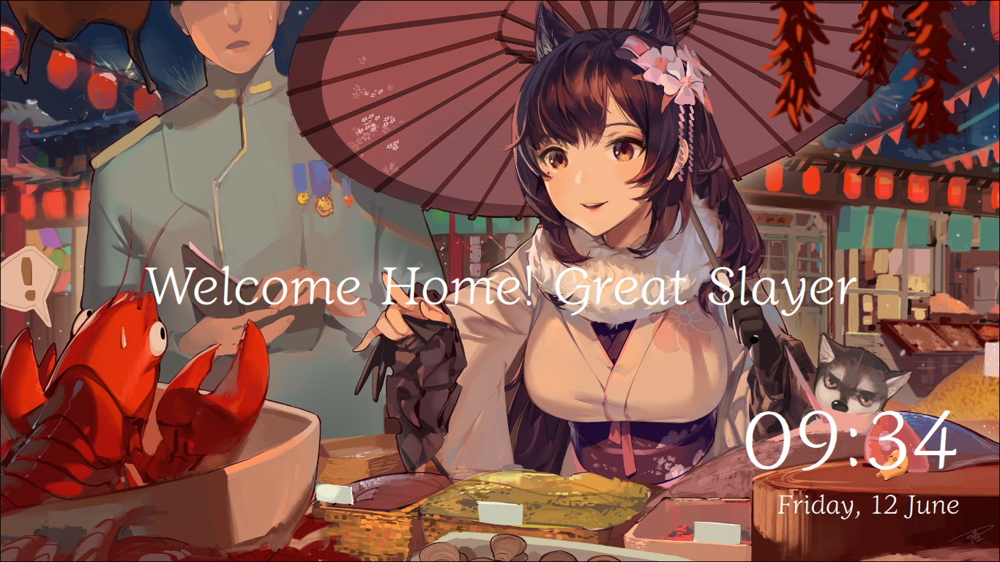
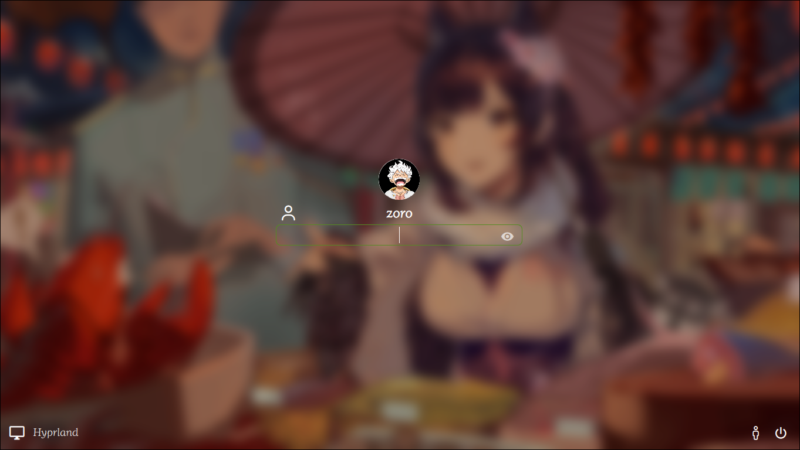

 <h2 align='center'>🌲 Atago theme for SDDM (SDDM Slayer)</h2>




SDDM-Slayer is a modern eye-candy theme for SDDM, making use of Nerd Fonts for its icons.

Written from scratch, it is primarily made for standalone SDDM, aiming to be customisable with accessibility options.

### Dependencies

> [!NOTE]
> Package names used below are for Arch Linux, packages may vary for your distro

* sddm
* a [Nerd Font](https://www.nerdfonts.com/font-downloads) installed system-wide >= v3.0
* qt6 >= 6.6
  * qt6-declarative
  * qt6-5compat

## Manual Installation

<details> <summary><h6>Install by cloning</h6> (recommended)</summary>

1- Clone this repository and delete the `.git` folder
```
$ git clone https://github.com/vinayakgupta29/sddm-slayer.git ~/sddm-slayer && rm -rf ~/sddm-slayer/.git
```

2- Move the resulting directory to your theme directory
```
$ sudo mv ~/sddm-slayer /usr/share/sddm/themes/
```
</details>

<!-- <details> <summary><h6>Install by downloading an archive on pling</h6></summary> 

1- Go to [the theme's page](https://www.pling.com/p/2191680/) on pling.com and download a release from the `Files` tab

2- Extract the tarball to your SDDM theme directory *(change the archive path if needed)*:
```
$ sudo tar -xzvf ~/sequoia.tar.gz -C /usr/share/sddm/themes
```
</details>

*Click on an installation method above for steps 1 -> 2* -->

3- Edit your [SDDM config file](https://man.archlinux.org/man/sddm.conf.5), under `[Theme]` change `Current=` to `Current=sequoia`

It should look like this:

```conf
[Theme]
Current=sddm-slayer
```

> [!IMPORTANT]
> Make sure to match the theme name with the theme's directory

### On screen keyboard

If you wish to use the virtual keyboard, install [qt6-virtualkeyboard](https://archlinux.org/packages/?name=qt6-virtualkeyboard)

then edit once again your SDDM config file, under `[General]` set `InputMethod` to `qtvirtualkeyboard`:

```conf
[General]
InputMethod=qtvirtualkeyboard
```

see also: [the Arch wiki guide](https://wiki.archlinux.org/title/SDDM#Enable_virtual_keyboard)

### Testing

You can easily try out themes without changing your SDDM config or repeatedly logging out using this command:

```
$ sddm-greeter-qt6 --test-mode --theme /path/to/your/theme
```

It's quite the time-saver when configuring your `theme.conf` file.

<!-- ## Support -->

## LICENSE 

    GPL v3.0
